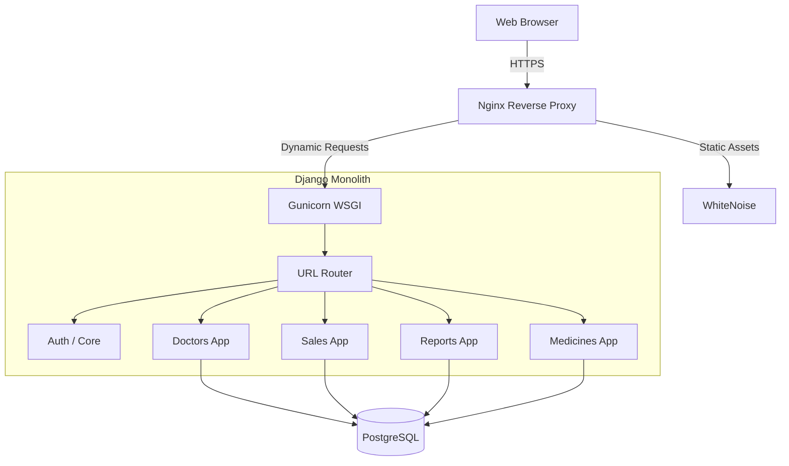
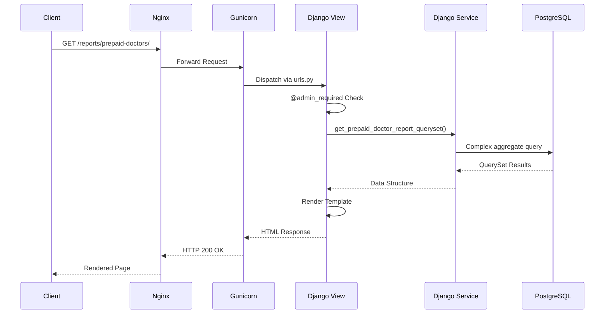

# Architecture

Medburg CRM is a monolithic web application built on the Django framework. The architecture is designed to handle rigid financial tracking, specifically for prepaid ROI investments and postpaid commission ledgers.

## Overall Architecture

## Django Application Layers

The codebase is strictly separated by business domain into individual Django apps. Cross-app dependencies are allowed but generally flow downwards (e.g., Sales depends on Doctors and Medicines).

### `core`
Contains shared utilities, constants, abstract base models (`BaseModel`), and custom decorators (`@admin_required`).

### `accounts`
Handles user authentication and the custom User model (separating Admin users from Sales Reps).

### `medicines`
Manages the product catalogue. Includes models for `Medicine` (prices, names).
*Note:* The `pts` field here is a reference value; financial calculations rely on frozen snapshots in the `sales` app.

### `doctors`
Manages the `Doctor` profiles, the `Investment` model (prepaid financial commitment), and the `DoctorMedicine` mapping.

### `sales`
The largest and most complex app. Manages transactional data:
- `SalesEntry` (Prepaid sales line items).
- `PostpaidCampaign` (Monthly ledger for postpaid commissions).
- `PostpaidSaleEntry` (Line items for postpaid).
- `CampaignPayment` (Append-only ledger deductions).
- `PostpaidCampaignCorrection` (Audit layer).

### `reports`
A read-only presentation layer. It does not own any database tables (no migrations). It heavily utilizes Django ORM aggregations to query data from `sales` and `doctors` to generate the HTML views and Excel exports.

## Request Lifecycle

## Design Principles

1.  **Fat Models, Thin Views, Service Layers:** Business logic related to object lifecycle (validation, snapshots) lives in the Model `clean()` and `save()` methods. Complex aggregations and multi-model orchestration live in explicit `services/` modules (e.g., `analytics_service.py`, `report_service.py`). Views are restricted to handling request parameters and returning HTTP responses.
2.  **Append-Only Financials:** Financial records (campaign payments, audit corrections, sales snapshots) are immutable once saved.
3.  **Strict State Machines:** Workflows follow rigid state transitions (e.g., Postpaid Campaigns: Awaiting -> Open -> Partial -> Settled -> Locked).

For more details on the financial architecture, read the [ROI System](ROI_SYSTEM.md) and [Business Logic](BUSINESS_LOGIC.md) documentation.
