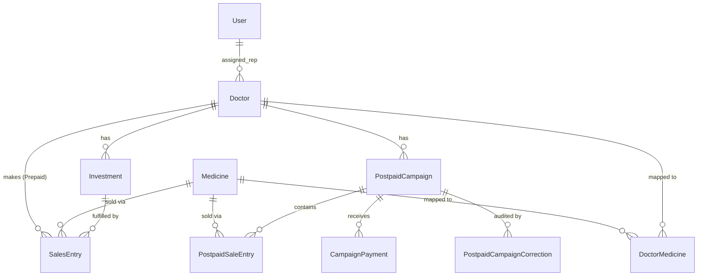

# Database Schema

Medburg CRM uses PostgreSQL in production. The database architecture is designed with financial integrity as the foremost priority, heavily utilizing foreign key constraints and "snapshot" fields to prevent historical data mutation.

## Entity-Relationship Diagram

## Core Models & Relationships

### `doctors` App
*   **`Doctor`**: The central entity representing a prescriber. Contains `mode` (`prepaid` vs `postpaid`), dictating their business logic track.
    *   *Proxy Models*: `PrepaidDoctor` and `PostpaidDoctor` are Django proxy models used solely to create distinct admin interfaces for the two different business tracks without duplicating database tables.
*   **`Investment`**: Represents a financial commitment (prepaid ROI). Belongs to a Doctor.
*   **`DoctorMedicine`**: A through-table (M:N) mapping which `Medicine` products are approved for which `Doctor`.

### `medicines` App
*   **`Medicine`**: The product catalogue. Contains `ptr` (retail), `mrp` (max retail), and `pts` (stockist) pricing.
    *   *Note on `pts`:* This is a live, mutable reference value. It is **never** joined directly in financial aggregation queries. Financial queries must always use the frozen snapshots in the `sales` tables.

### `sales` App (Prepaid Track)
*   **`SalesEntry`**: A ledger row for prepaid sales. Links a `Doctor`, `Medicine`, and `Investment`. Contains frozen `value_at_sale` and `pts_at_sale` snapshots.

### `sales` App (Postpaid Track)
*   **`PostpaidCampaign`**: A monthly ledger aggregating postpaid sales for a specific doctor.
*   **`PostpaidSaleEntry`**: Line items belonging to a campaign, tracking quantity and frozen commission snapshots.
*   **`CampaignPayment`**: An append-only ledger tracking money transferred to settle the campaign.
*   **`PostpaidCampaignCorrection`**: An append-only audit trail for adjustments made after a campaign has been locked.

## Migration Philosophy

Database migrations in Medburg CRM follow strict safety protocols:

1.  **Additive Preference:** We prefer adding tables and columns over renaming or modifying existing ones.
2.  **No Deletions of Financial Data:** Tables holding financial histories (like the legacy `PostpaidEntry` removed in MR-8.0) are only dropped after a rigorous, multi-release backfill and deprecation process ensuring data is safely migrated to the new schema (`PostpaidCampaign` engine).
3.  **Data Migrations:** When business logic changes (e.g., ARCH-2A), data migrations are used to backfill snapshot fields carefully before removing legacy calculation pathways.
